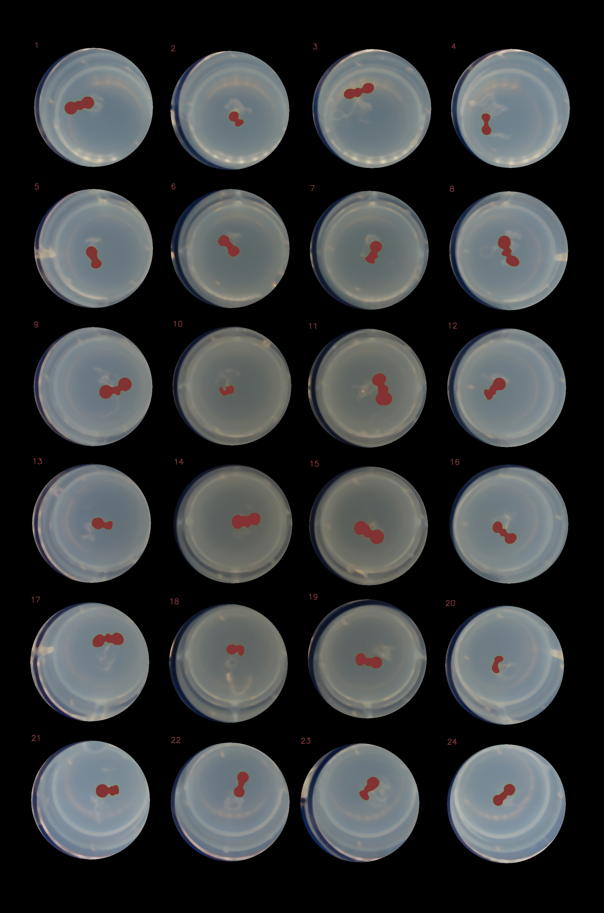

# Plant segment

## Example debug output



## Run

1. Place JPGs into `data` folder
2. Run
```bash
python3 main.py
```
3. Expect debug output in `debug` folder and results in `result.csv` file

## ToDo

- [ ] Parallelize
